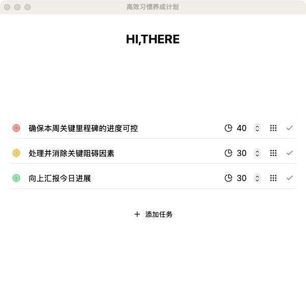
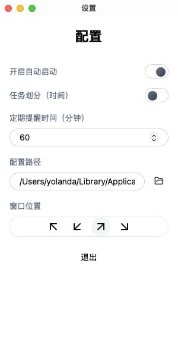

# task reminder
根据**高效人士的七个习惯**打造的一款桌面任务应用，帮助用户管理每日最重要的任务，定期提醒，避免被繁杂的任务淹没。

支持windows和macos系统。

前端：react+vite+tailwindcss
后端：rust+tauri

## 功能说明

每天打开电脑第一件事，思考今天最重要的三件事，并为他们配置权重，添加到任务列表中。



配置页面可调整任务列表展示的位置，任务提醒频率。




## 本地部署说明
1. 环境准备

- nodejs
- yarn
- rust

    1）window环境:
    - visual studio developer command prompt
    - https://rustup.rs/
    - 安装rust环境

    2）mac环境:
    - 安装rust
    ```bash
    curl --proto '=https' --tlsv1.2 -sSf https://sh.rustup.rs | sh
    ```
    - 安装tauri
    ```bash
    cargo install tauri-cli
    ```

2. 本地运行程序

    ```bash
    yarn install # 安装依赖
    yarn tauri dev # 本地运行程序
    ```

3. 打包

    ```bash
    yarn tauri build
    ```

    成果物目录

    .src-tauri/target/release/bundle/
